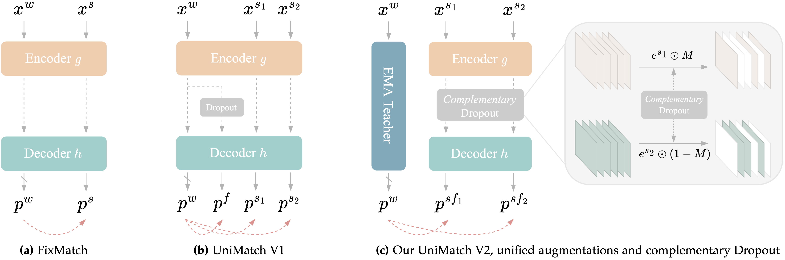

# UniMatch V2

This codebase contains the official PyTorch implementation of <b>UniMatch V2</b>:

> **[UniMatch V2: Pushing the Limit of Semi-Supervised Semantic Segmentation]()**</br>
> Lihe Yang, Zhen Zhao, Wanli Ouyang, Hengshuang Zhao</br>
> Preprint, 2024

<p align="left">

</p>

**TL;DR:** We upgrade our [UniMatch V1](https://github.com/LiheYoung/UniMatch) by switching the outdated ResNet encoders to the most capable DINOv2 encoders. We unify the image-level and feature-level augmentations into a single learnable stream to challenge the powerful model. Based on this, we further design a Complementary Dropout to craft better dual views.

## Results

**We provide the [training log of each reported value](https://github.com/LiheYoung/UniMatch-V2/blob/main/training-logs). You can refer to them during reproducing. We also provide all the [checkpoints](https://huggingface.co/LiheYoung/UniMatch-V2/tree/main) of our core experiments.**

### Pascal VOC 2012

| Method            |    Encoder  | 1/16 (92) | 1/8 (183) | 1/4 (366) | 1/2 (732) | Full (1464) |
| :---------------: | :---------: | :-------: | :-------: | :-------: | :-------: | :---------: |
| UniMatch V1       | ResNet-101  |   75.2    |   77.2    |    78.8   |    79.9   |     81.2    |
| AllSpark          |    MiT-B5   |   76.1    |   78.4    |    79.8   |    80.8   |     82.1    |
| SemiVL            |  CLIP-Base  |   84.0    |   85.6    |    86.0   |    86.7   |     87.3    |
| **UniMatch V2**   | DINOv2-Base | **86.3**  | **87.9**  | **88.9**  | **90.0**  |   **90.8**  |

### Cityscapes

| Method            |    Encoder  | 1/16 (186)| 1/8 (372) | 1/4 (744) | 1/2 (1488)|
| :---------------: | :---------: | :-------: | :-------: | :-------: | :-------: |
| UniMatch V1       | ResNet-101  |   76.6    |   77.9    |    79.2   |    79.5   |
| AllSpark          |    MiT-B5   |   78.3    |   79.2    |    80.6   |    81.4   |
| SemiVL            |  CLIP-Base  |   77.9    |   79.4    |    80.3   |    80.6   |
| **UniMatch V2**   | DINOv2-Base | **83.6**  | **84.3**  | **84.5**  | **85.1**  |

### ADE20K

| Method            |    Encoder  | 1/64 (316)| 1/32 (631)|1/16 (1263)| 1/8 (2526)|
| :---------------: | :---------: | :-------: | :-------: | :-------: | :-------: |
| UniMatch V1       | ResNet-101  |   21.6    |   28.1    |    31.5   |    34.6   |
| SemiVL            |  CLIP-Base  |   33.7    |   35.1    |    37.2   |    39.4   |
| **UniMatch V2**   | DINOv2-Base | **38.7**  | **45.0**  | **46.7**  | **49.8**  |

### COCO

| Method            |    Encoder  |1/512 (232)|1/256 (463)|1/128 (925)|1/64 (1849)| 1/32 (3697) |
| :---------------: | :---------: | :-------: | :-------: | :-------: | :-------: | :---------: |
| UniMatch V1       | ResNet-101  |   31.9    |   38.9    |    44.4   |    48.2   |     49.8    |
| AllSpark          |    MiT-B5   |   34.1    |   41.7    |    45.5   |    49.6   |     ---     |
| SemiVL            |  CLIP-Base  | **50.1**  |   52.8    |    53.6   |    55.4   |     56.5    |
| **UniMatch V2**   | DINOv2-Base |    47.9   | **55.8**  | **58.7**  | **60.4**  |   **63.3**  |

### Real-World Large-Scale SSS Setting

In addition to the above traditional SSS settings, we also explore a real-world large-scale setting, where substantial images (*e.g.*, 10K) have already been annotated, and menatime much more unlabeled images (*e.g.*, 100K) are available. It is challenging but highly meaningful.

|  Labeled Data (# Img)  |  + Unlabeled Data (# Img)  |   Improvement  |
| :--------------------: | :------------------------: | :------------: |
| COCO (118K)            | COCO Extra (123K)          |66.4 &rarr; 67.1|
| ADE20K (20K)           | COCO Labeled (118K)        |54.1 &rarr; 54.9|
| ADE20K (20K)           | COCO All (118K + 123K)     |54.1 &rarr; 55.7|
| Cityscapes (3K)        | Cityscapes Extra (20K)     |85.2 &rarr; 85.5|


## Getting Started

### Pre-trained Encoders

[DINOv2-Small](https://dl.fbaipublicfiles.com/dinov2/dinov2_vits14/dinov2_vits14_pretrain.pth) | [DINOv2-Base](https://dl.fbaipublicfiles.com/dinov2/dinov2_vitb14/dinov2_vitb14_pretrain.pth) | [DINOv2-Large](https://dl.fbaipublicfiles.com/dinov2/dinov2_vitl14/dinov2_vitl14_pretrain.pth)

```
├── ./pretrained
    ├── dinov2_small.pth
    ├── dinov2_base.pth
    └── dinov2_large.pth
```

### Datasets

- Pascal: [JPEGImages](http://host.robots.ox.ac.uk/pascal/VOC/voc2012/VOCtrainval_11-May-2012.tar) | [SegmentationClass](https://drive.google.com/file/d/1ikrDlsai5QSf2GiSUR3f8PZUzyTubcuF/view?usp=sharing)
- Cityscapes: [leftImg8bit](https://www.cityscapes-dataset.com/file-handling/?packageID=3) | [gtFine](https://drive.google.com/file/d/1E_27g9tuHm6baBqcA7jct_jqcGA89QPm/view?usp=sharing)
- ADE20K: [images](http://data.csail.mit.edu/places/ADEchallenge/ADEChallengeData2016.zip) | [annotations](https://drive.google.com/file/d/1f2a4d_mycaI4JCqz-EAVLXVwb6s5EsWa/view?usp=sharing)
- COCO: [train2017](http://images.cocodataset.org/zips/train2017.zip) | [val2017](http://images.cocodataset.org/zips/val2017.zip) | [masks](https://drive.google.com/file/d/166xLerzEEIbU7Mt1UGut-3-VN41FMUb1/view?usp=sharing)

Please modify your dataset path in configuration files.

**The ADE20K and COCO annotations have already been pre-processed by us. You can use them directly.**

```
├── [Your Pascal Path]
    ├── JPEGImages
    └── SegmentationClass
    
├── [Your Cityscapes Path]
    ├── leftImg8bit
    └── gtFine

├── [Your ADE20K Path]
    ├── images
    │   ├── training
    │   └── validation
    └── annotations
        ├── training
        └── validation

├── [Your COCO Path]
    ├── train2017
    ├── val2017
    └── masks
```

## Training

### UniMatch V2

```bash
# use torch.distributed.launch
sh scripts/train.sh <num_gpu> <port>
# to fully reproduce our results, the <num_gpu> should be set as 4 on all four datasets
# otherwise, you need to adjust the learning rate accordingly

# or use slurm
# sh scripts/slurm_train.sh <num_gpu> <port> <partition>
```

To train on other datasets or splits, please modify
``dataset`` and ``split`` in [train.sh](https://github.com/LiheYoung/UniMatch-V2/blob/main/scripts/train.sh).

### FixMatch

Modify the ``method`` from ``'unimatch_v2'`` to ``'fixmatch'`` in [train.sh](https://github.com/LiheYoung/UniMatch-V2/blob/main/scripts/train.sh).

### Supervised Baseline

Modify the ``method`` from ``'unimatch'`` to ``'supervised'`` in [train.sh](https://github.com/LiheYoung/UniMatch-V2/blob/main/scripts/train.sh). 


## Citation

If you find this project useful, please consider citing:

```bibtex
@article{unimatchv2,
  title={UniMatch V2: Pushing the Limit of Semi-Supervised Semantic Segmentation},
  author={Yang, Lihe and Zhao, Zhen and Ouyang, Wanli and Zhao, Hengshuang},
  journal={arXiv:},
  year={2024}
}
```
